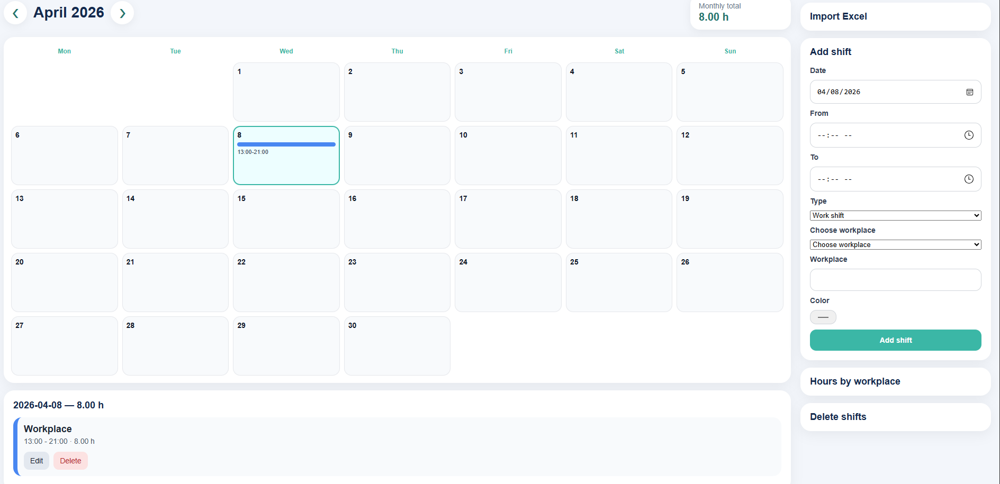

# Kalender og oversikt

## Hva viser kalenderen?

Kalenderen gir en samlet oversikt over alle registreringer i AppWork.

Du kan se:

- arbeidsskift
- planlagte aktiviteter
- datoer med registreringer
- detaljer per dag

---

## Hvordan bruke kalenderen

### Velg måned

Bruk kalenderen for å gå mellom måneder.

### Klikk på en dag

Når du klikker på en dag, kan du se:

- hvilke registreringer som finnes
- om det er **Shift** eller **Plan**
- detaljer for den valgte datoen

---

## Hvorfor er kalenderen nyttig?

Kalenderen gjør det lettere å:

- planlegge arbeid
- se hva som allerede er registrert
- finne feil eller manglende registreringer
- kontrollere data før lønnsberegning

---

