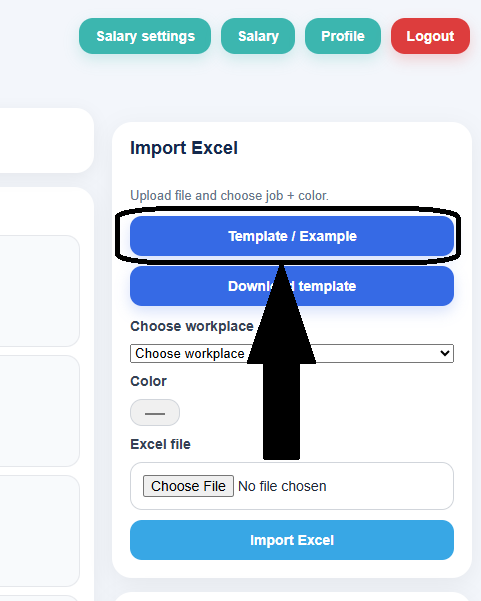
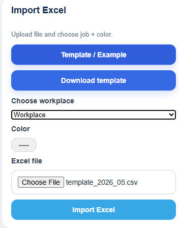
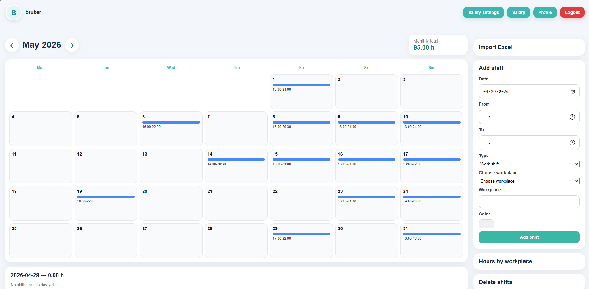

# Importer Excel-fil

## Hva brukes Excel-import til?

Excel-import gjør det mulig å legge inn flere skift samtidig i stedet for å skrive alt manuelt.

Dette er nyttig når du:

- har mange skift
- vil spare tid
- ønsker rask registrering av flere dager

---

## Før du importerer

Før du laster opp en Excel-fil, må du kontrollere at filen har riktig format.

Du kan se riktig format og laste ned mal her:

!!! warning "Viktig"
    Excel-filen må følge malen. Hvis dato, starttid eller sluttid er skrevet feil, kan importen feile.

!!! info "Anbefalt skjermbilde"
    Bruk et skjermbilde av Import Excel-boksen på dashboardet, der man ser knappene **Template / Example**, **Download template**, valg av arbeidsplass og opplasting av fil.
---

## Riktig format

Excel-filen skal inneholde disse kolonnene:

| Date | Start | End |
|---|---|---|
| 2026-05-01 | 14 | 22 |
| 2026-05-02 | 16.5 | 21.5 |

!!! tip "Tips"
    `16.5` betyr 16:30. Bruk malen fra AppWork for å unngå feil format.

---

## Slik importerer du

### Steg 1: Åpne import-funksjonen

Gå til **Import Excel** på dashboardet.

### Steg 2: Last ned template

Klikk på **Template / Example** eller **Download template** for å se riktig format.

### Steg 3: Fyll inn Excel-filen

Fyll inn dato, starttid og sluttid i riktig format.

### Steg 4: Velg arbeidsplass

Velg riktig arbeidsplass før du importerer filen.

!!! warning "Viktig"
    Hvis arbeidsplass ikke er valgt, kan ikke systemet koble skiftene til riktig jobb.

### Steg 5: Velg fil og importer

Klikk på **Choose File**, velg Excel-filen og trykk **Import Excel**.

---

## Etter import

Kontroller at:

- skiftene vises i kalenderen
- datoene stemmer
- riktig arbeidsplass er valgt
- timer og lønn oppdateres riktig

---

