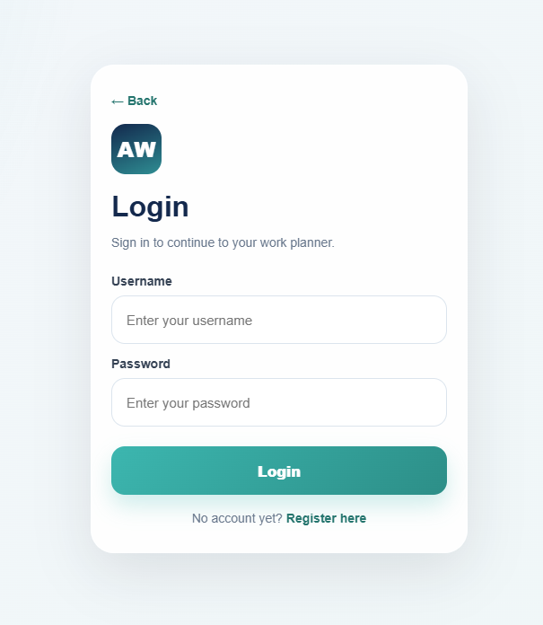

# Logg inn i AppWork

## Slik logger du inn

Følg disse stegene for å åpne AppWork og logge inn.

### Steg 1: Åpne nettsiden

Klikk på lenken til AppWork:

[Åpne AppWork](http://10.0.0.144:8082)

### Steg 2: Skriv inn brukernavn og passord

På innloggingssiden skriver du inn:

- brukernavn
- passord

Klikk deretter på **Logg inn**.

### Steg 3: Du kommer til hovedsiden

Etter innlogging åpnes hovedsiden der du kan:

- se kalender
- legge til skift
- importere Excel-fil
- se timer og lønn

---

