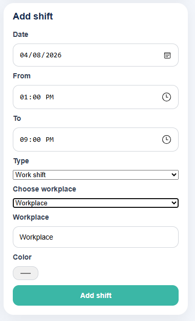

# Legg til arbeidsskift

## Registrer et nytt skift

AppWork lar deg registrere arbeidsskift manuelt direkte i systemet.

---

## Slik gjør du det

### Steg 1: Velg dato

Velg dagen du jobbet.

### Steg 2: Velg type registrering

Velg riktig type:

- **Shift** = faktisk arbeid
- **Plan** = planlagt aktivitet eller annet

### Steg 3: Velg arbeidsplass

Velg riktig arbeidsplass fra listen.

!!! warning "Viktig"
    For at timer og lønn skal regnes riktig, må du velge **Shift** og riktig **arbeidsplass**.

### Steg 4: Legg inn tid

Fyll inn starttid og sluttid.

### Steg 5: Lagre

Klikk på **Add shift** for å registrere skiftet.

---

## Resultat

Etter lagring vil skiftet vises i kalenderen og bli brukt i oversikter for:

- timer
- lønn
- arbeidsplass

