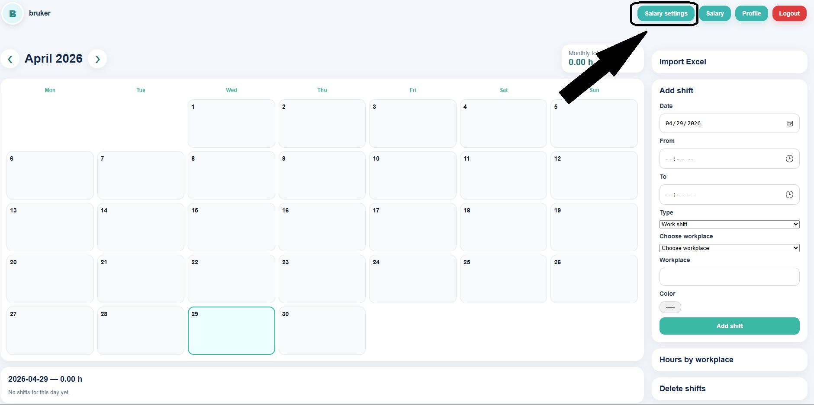
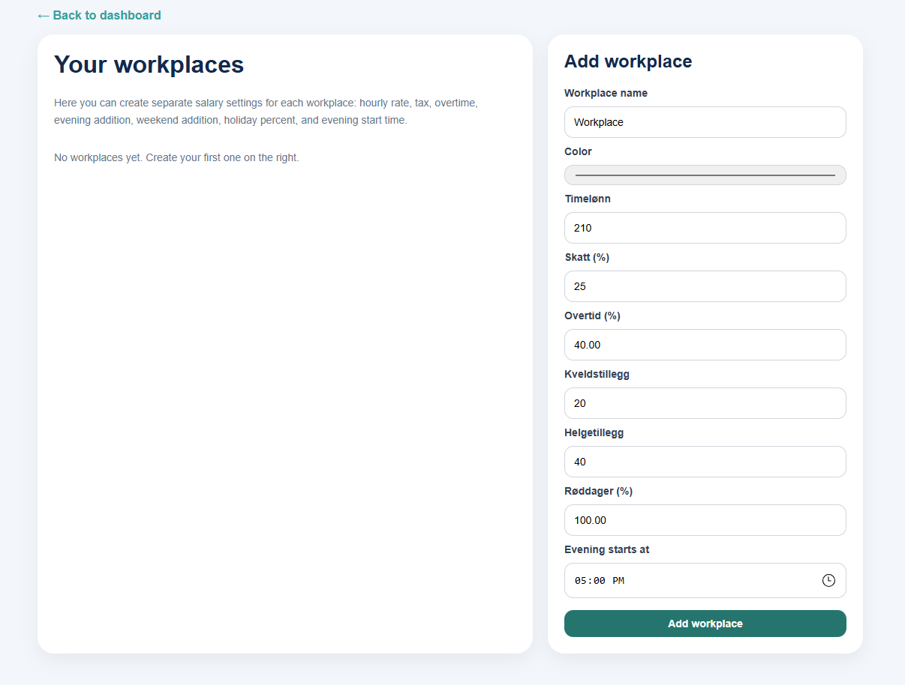
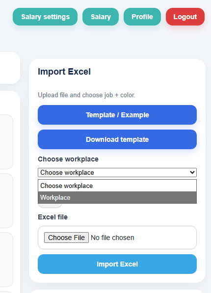

# Første oppsett: Arbeidsplass

## Hvorfor må arbeidsplass legges til først?

Før du registrerer et arbeidsskift, må du ha minst én arbeidsplass i systemet.  
Arbeidsplassen brukes for å:

- knytte skift til riktig jobb
- beregne lønn riktig
- vise timer per arbeidsplass

!!! warning "Viktig"
    Hvis du ikke velger arbeidsplass på et skift, vil skiftet ikke telle riktig i lønnsoversikten.

---

## Slik legger du til en arbeidsplass

### Steg 1: Åpne arbeidsplass-seksjonen

Gå til siden der du kan administrere arbeidsplasser.

### Steg 2: Legg inn informasjon

Fyll inn:

- navn på arbeidsplass
- timepris eller annen relevant informasjon

### Steg 3: Lagre

Klikk på **Lagre** eller **Opprett**.

---

## Etterpå

Når arbeidsplassen er opprettet, kan du velge den når du:

- oppretter et nytt skift
- importerer Excel-fil
- ser lønnsoversikt

